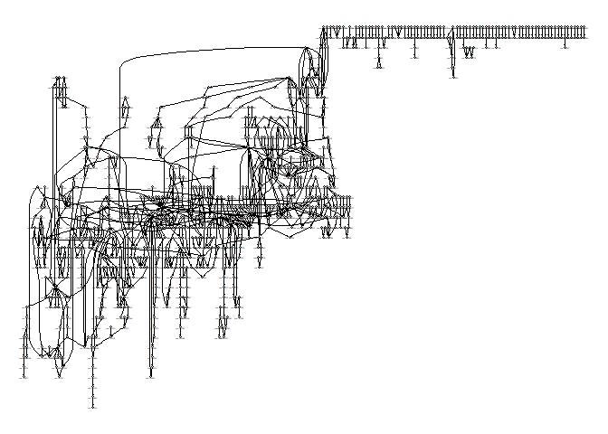
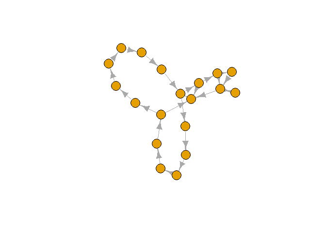

KEGG network
================
Zhifeng Yang
11/6/2020

## A whole KEGG network of E.coli

``` r
mapfile <-  "xml/eco01100.xml"
map <- parseKGML(mapfile)
map
```

    ## KEGG Pathway
    ## [ Title ]: Metabolic pathways
    ## [ Name ]: path:eco01100
    ## [ Organism ]: eco
    ## [ Number ] :01100
    ## [ Image ] :https://www.kegg.jp/kegg/pathway/eco/eco01100.png
    ## [ Link ] :https://www.kegg.jp/kegg-bin/show_pathway?eco01100
    ## ------------------------------------------------------------
    ## Statistics:
    ##  6594 node(s)
    ##  0 edge(s)
    ##  957 reaction(s)
    ## ------------------------------------------------------------

``` r
reactions <- getReactions(map)
```

``` r
###################################################
### code chunk number 20: cnexample
###################################################
chemicalGraph <- KEGGpathway2reactionGraph(map)

outDegrees <- sapply(edges(chemicalGraph), length)
maxout <- names(sort(outDegrees,decreasing=TRUE))[1:3]

# nAttrs <- list()
# maxoutlabel <- as.list(maxout); names(maxoutlabel) <- maxout
# nAttrs$label <- makeAttr(chemicalGraph, "", maxoutlabel)
# nAttrs$fillcolor <- makeAttr(chemicalGraph, "lightblue", list(orange=maxout))
# nAttrs$width <- makeAttr(chemicalGraph,"0.8", list("1.8"=maxout))
plot(chemicalGraph)
```

    ## Warning in arrows(head_from[1], head_from[2], head_to[1], head_to[2], col =
    ## edgeColor, : zero-length arrow is of indeterminate angle and so skipped
    
    ## Warning in arrows(head_from[1], head_from[2], head_to[1], head_to[2], col =
    ## edgeColor, : zero-length arrow is of indeterminate angle and so skipped

    ## Warning in arrows(tail_from[1], tail_from[2], tail_to[1], tail_to[2], col =
    ## edgeColor, : zero-length arrow is of indeterminate angle and so skipped

    ## Warning in arrows(head_from[1], head_from[2], head_to[1], head_to[2], col =
    ## edgeColor, : zero-length arrow is of indeterminate angle and so skipped
    
    ## Warning in arrows(head_from[1], head_from[2], head_to[1], head_to[2], col =
    ## edgeColor, : zero-length arrow is of indeterminate angle and so skipped
    
    ## Warning in arrows(head_from[1], head_from[2], head_to[1], head_to[2], col =
    ## edgeColor, : zero-length arrow is of indeterminate angle and so skipped
    
    ## Warning in arrows(head_from[1], head_from[2], head_to[1], head_to[2], col =
    ## edgeColor, : zero-length arrow is of indeterminate angle and so skipped
    
    ## Warning in arrows(head_from[1], head_from[2], head_to[1], head_to[2], col =
    ## edgeColor, : zero-length arrow is of indeterminate angle and so skipped
    
    ## Warning in arrows(head_from[1], head_from[2], head_to[1], head_to[2], col =
    ## edgeColor, : zero-length arrow is of indeterminate angle and so skipped
    
    ## Warning in arrows(head_from[1], head_from[2], head_to[1], head_to[2], col =
    ## edgeColor, : zero-length arrow is of indeterminate angle and so skipped
    
    ## Warning in arrows(head_from[1], head_from[2], head_to[1], head_to[2], col =
    ## edgeColor, : zero-length arrow is of indeterminate angle and so skipped
    
    ## Warning in arrows(head_from[1], head_from[2], head_to[1], head_to[2], col =
    ## edgeColor, : zero-length arrow is of indeterminate angle and so skipped
    
    ## Warning in arrows(head_from[1], head_from[2], head_to[1], head_to[2], col =
    ## edgeColor, : zero-length arrow is of indeterminate angle and so skipped
    
    ## Warning in arrows(head_from[1], head_from[2], head_to[1], head_to[2], col =
    ## edgeColor, : zero-length arrow is of indeterminate angle and so skipped
    
    ## Warning in arrows(head_from[1], head_from[2], head_to[1], head_to[2], col =
    ## edgeColor, : zero-length arrow is of indeterminate angle and so skipped
    
    ## Warning in arrows(head_from[1], head_from[2], head_to[1], head_to[2], col =
    ## edgeColor, : zero-length arrow is of indeterminate angle and so skipped
    
    ## Warning in arrows(head_from[1], head_from[2], head_to[1], head_to[2], col =
    ## edgeColor, : zero-length arrow is of indeterminate angle and so skipped
    
    ## Warning in arrows(head_from[1], head_from[2], head_to[1], head_to[2], col =
    ## edgeColor, : zero-length arrow is of indeterminate angle and so skipped
    
    ## Warning in arrows(head_from[1], head_from[2], head_to[1], head_to[2], col =
    ## edgeColor, : zero-length arrow is of indeterminate angle and so skipped
    
    ## Warning in arrows(head_from[1], head_from[2], head_to[1], head_to[2], col =
    ## edgeColor, : zero-length arrow is of indeterminate angle and so skipped
    
    ## Warning in arrows(head_from[1], head_from[2], head_to[1], head_to[2], col =
    ## edgeColor, : zero-length arrow is of indeterminate angle and so skipped
    
    ## Warning in arrows(head_from[1], head_from[2], head_to[1], head_to[2], col =
    ## edgeColor, : zero-length arrow is of indeterminate angle and so skipped
    
    ## Warning in arrows(head_from[1], head_from[2], head_to[1], head_to[2], col =
    ## edgeColor, : zero-length arrow is of indeterminate angle and so skipped
    
    ## Warning in arrows(head_from[1], head_from[2], head_to[1], head_to[2], col =
    ## edgeColor, : zero-length arrow is of indeterminate angle and so skipped
    
    ## Warning in arrows(head_from[1], head_from[2], head_to[1], head_to[2], col =
    ## edgeColor, : zero-length arrow is of indeterminate angle and so skipped
    
    ## Warning in arrows(head_from[1], head_from[2], head_to[1], head_to[2], col =
    ## edgeColor, : zero-length arrow is of indeterminate angle and so skipped
    
    ## Warning in arrows(head_from[1], head_from[2], head_to[1], head_to[2], col =
    ## edgeColor, : zero-length arrow is of indeterminate angle and so skipped
    
    ## Warning in arrows(head_from[1], head_from[2], head_to[1], head_to[2], col =
    ## edgeColor, : zero-length arrow is of indeterminate angle and so skipped
    
    ## Warning in arrows(head_from[1], head_from[2], head_to[1], head_to[2], col =
    ## edgeColor, : zero-length arrow is of indeterminate angle and so skipped
    
    ## Warning in arrows(head_from[1], head_from[2], head_to[1], head_to[2], col =
    ## edgeColor, : zero-length arrow is of indeterminate angle and so skipped
    
    ## Warning in arrows(head_from[1], head_from[2], head_to[1], head_to[2], col =
    ## edgeColor, : zero-length arrow is of indeterminate angle and so skipped

<!-- -->

``` r
members <- membership(clusters(graph_from_graphnel(chemicalGraph), mode="strong"))
strongly_connected=lapply(unique(members), function (x) induced.subgraph(graph_from_graphnel(chemicalGraph), which(members == x)))

g=graph_from_graphnel(chemicalGraph)
S=induced.subgraph(g, which(members == which(table(members)==max(table(members)))))
plot(S,vertex.label=NA)
```

<!-- -->

``` r
url=getKGMLurl("eco01100",organism ="eco")
download.file(url, "xml/eco01100.xml")
```
